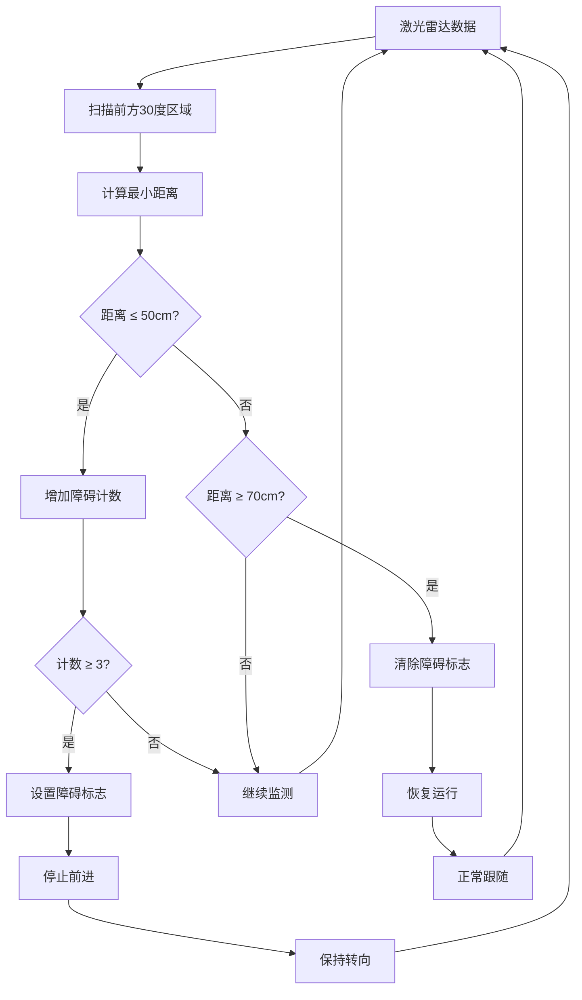

# 障碍检测功能说明

## 功能概述
为 `cam_follow_node.py` 添加了前方50cm障碍检测和自动停止功能，确保机器人在跟随目标时能够安全避开障碍物。

## 主要特性

### 1. 智能障碍检测
- **检测距离**: 50cm (可配置)
- **检测范围**: 前方±15度扇形区域 (总30度)
- **检测精度**: 使用激光雷达多点检测，取最小距离值
- **抗干扰**: 连续检测3次才确认障碍存在，避免误报

### 2. 安全停止机制
- 检测到障碍时立即停止前进
- 保持转向功能，允许机器人调整方向
- 障碍消失后自动恢复运行

### 3. 渐进式速度控制
- 距离1.5m内开始减速
- 距离越近速度越慢
- 50cm内完全停止

## 参数配置

```python
# 障碍检测参数
self.obstacle_distance_threshold = 0.50  # 障碍检测距离阈值 (m)
self.obstacle_detection_angle = 30      # 前方检测角度范围 (度)
self.obstacle_count_threshold = 3       # 连续检测次数阈值
self.obstacle_recovery_distance = 0.70  # 障碍消失恢复距离 (m)
```

## 工作流程



## 使用方法

### 1. 运行主程序
```bash
rosrun your_package cam_follow_node.py
```

### 2. 测试障碍检测
```bash
# 单独测试障碍检测功能
rosrun your_package test_obstacle_detection.py

# 测试基础转向功能
rosrun your_package test_basic_turn.py
```

### 3. 观察日志输出
程序会输出详细的状态信息：
```
=== CONTROL STATUS ===
Speed: 0.00, Turn: 0.15
Obstacle: BLOCKED (dist: 0.45m)
Targets detected: 1
======================
```

## 安全特性

### 1. 多重保护
- 激光雷达障碍检测
- 连续确认机制
- 渐进式减速

### 2. 智能恢复
- 障碍消失自动恢复
- 滞后距离防止振荡
- 保持目标跟随状态

### 3. 实时监控
- 详细日志输出
- 状态可视化
- 调试信息完整

## 调试和调优

### 1. 如果检测过于敏感
```python
# 增大检测距离阈值
self.obstacle_distance_threshold = 0.40

# 增大确认次数
self.obstacle_count_threshold = 5

# 减小检测角度
self.obstacle_detection_angle = 20
```

### 2. 如果检测不够敏感
```python
# 减小检测距离阈值
self.obstacle_distance_threshold = 0.60

# 减小确认次数
self.obstacle_count_threshold = 2

# 增大检测角度
self.obstacle_detection_angle = 45
```

### 3. 如果出现振荡
```python
# 增大恢复距离
self.obstacle_recovery_distance = 0.80

# 增大确认次数
self.obstacle_count_threshold = 4
```

## 日志说明

| 日志类型 | 含义 | 示例 |
|----------|------|------|
| `OBSTACLE DETECTED!` | 检测到障碍物 | `Distance: 0.45m - STOPPING ROBOT` |
| `Obstacle cleared!` | 障碍物消失 | `Distance: 0.75m - RESUMING` |
| `Speed blocked by obstacle` | 速度被障碍阻止 | `Speed blocked by obstacle at 0.45m` |
| `Speed reduced due to proximity` | 接近减速 | `factor=0.50, new_speed=0.15` |

## 注意事项

1. **激光雷达话题**: 确保 `/scan` 话题正常发布
2. **检测范围**: 30度检测角度适合大部分场景
3. **安全距离**: 50cm停止距离适合中低速运行
4. **恢复机制**: 70cm恢复距离防止频繁启停
5. **性能影响**: 障碍检测几乎不影响系统性能

## 测试建议

1. **静态测试**: 在机器人前方放置固定障碍物
2. **动态测试**: 手动移动障碍物测试检测和恢复
3. **边界测试**: 测试50cm和70cm边界距离
4. **角度测试**: 测试不同角度的障碍物检测
5. **运行测试**: 结合目标跟随功能完整测试